# CLAUDE.md

This file provides guidance to Claude Code (claude.ai/code) when working with code in this repository.

## Project Overview
**100% Apple Foundation Models β SDK Compatible Implementation**

OSS implementation of Apple's Foundation Models framework (iOS 18.2+/macOS 15.2+), providing on-device LLM capabilities with structured generation, tool calling, and streaming support.

### Swift 6.2 Requirements
This project requires **Swift 6.2** or later for development. Swift 6.2 introduces critical features that are essential for Apple Foundation Models compatibility:

- **Complete Concurrency Checking**: Ensures thread-safe implementations with strict Sendable conformance
- **Isolated Parameters**: Support for `isolated` and `sending` keywords in async methods
- **SendableMetatype Protocol**: Required for Tool and Generable protocol implementations
- **Improved Macro System**: Enhanced @Generable and @Guide macro capabilities
- **Non-copyable Types**: Support for `~Copyable` and `~Escapable` constraints

**Important**: Earlier Swift versions will not compile this project due to missing language features.

## Protocol Relationships Diagram

```mermaid
graph TB
    %% Core Protocol Hierarchy
    CFG[ConvertibleFromGeneratedContent]
    CTG[ConvertibleToGeneratedContent]
    IR[InstructionsRepresentable]
    PR[PromptRepresentable]
    SM[SendableMetatype]
    S[Sendable]
    
    %% Main Protocols
    G[Generable]
    T["Tool<Arguments, Output>"]
    
    %% Types
    GC[GeneratedContent]
    GS[GenerationSchema]
    GG[GenerationGuide]
    DGS[DynamicGenerationSchema]
    GID[GenerationID]
    TO[ToolOutput]
    
    %% Generable inherits from multiple protocols
    CFG --> G
    CTG --> G
    IR --> G
    PR --> G
    SM --> G
    
    %% Tool inheritance
    S --> T
    SM --> T
    
    %% GeneratedContent conforms to Generable
    G --> GC
    
    %% Associated types and requirements
    G -.->|"static var"| GS
    G -.->|"associatedtype"| PG["PartiallyGenerated: CFG"]
    G -.->|"func"| APG["asPartiallyGenerated()"]
    
    %% Tool associated types
    T -.->|"associatedtype"| TA["Arguments: CFG"]
    T -.->|"associatedtype"| TOP["Output: PR"]
    T -.->|"var"| TP["parameters: GenerationSchema"]
    
    %% Macro relationships
    GM["@Generable macro"] ===>|generates| G
    GuM["@Guide macro"] ===>|generates| GG
    
    %% Standard type conformances
    ST["String, Bool, Int, Float, Double"] --> G
    AR["Array<Element: Generable>"] --> G
    OP["Optional<Wrapped: Generable>"] --> G
    
    %% Legend
    classDef protocol fill:#e1f5fe,stroke:#01579b,stroke-width:2px
    classDef type fill:#fff3e0,stroke:#e65100,stroke-width:2px
    classDef macro fill:#f3e5f5,stroke:#4a148c,stroke-width:2px
    classDef standard fill:#e8f5e9,stroke:#1b5e20,stroke-width:2px
    
    class CFG,CTG,IR,PR,SM,S,G,T protocol
    class GC,GS,GG,DGS,GID,TO type
    class GM,GuM macro
    class ST,AR,OP standard
```



## Apple Foundation Models Complete Specification

### Core Architecture

#### LanguageModelSession
The central class for interacting with language models, maintaining conversation context through a Transcript.

**Key Properties:**
- `transcript: Transcript` - Complete conversation history
- `isResponding: Bool` - Indicates if response is being generated

**Initialization:**
```swift
// With string instructions
init(model: any LanguageModel, tools: [any Tool] = [], instructions: String? = nil)

// With Instructions builder
init(model: any LanguageModel, tools: [any Tool] = [], @InstructionsBuilder instructions: () throws -> Instructions)

// With existing transcript
init(model: any LanguageModel, tools: [any Tool] = [], transcript: Transcript)
```

**Response Methods:**
- `respond(to:options:)` - Generate string responses
- `respond(to:generating:options:)` - Generate typed responses with Generable
- `respond(to:schema:options:)` - Generate responses with explicit schema
- `streamResponse(...)` - Streaming variants of all response methods

**Response Structure:**
```swift
struct Response<Content: Sendable> {
    let content: Content
    let rawContent: GeneratedContent
    let transcriptEntries: ArraySlice<Transcript.Entry>
}

struct ResponseStream<Content: Sendable>: AsyncSequence {
    struct Snapshot {
        var content: Content
        var rawContent: GeneratedContent
    }
    func collect() async throws -> Response<Content>
}
```

### GeneratedContent System

#### GeneratedContent.Kind Enum
The fundamental representation of generated data:

```swift
enum Kind {
    case null                    // JSON null
    case bool(Bool)             // JSON boolean
    case number(Double)         // JSON number
    case string(String)         // JSON string
    case array([GeneratedContent])  // JSON array
    case structure(properties: [String: GeneratedContent], orderedKeys: [String])  // JSON object
}
```

**Important:** There is NO `partial` case. Partial JSON is handled internally through storage mechanisms, not as a Kind variant.

#### Data Access Methods
```swift
// Get properties from structure
func properties() throws -> [String: GeneratedContent]

// Get elements from array
func elements() throws -> [GeneratedContent]

// Get typed value
func value<Value>(_ type: Value.Type) throws -> Value where Value: ConvertibleFromGeneratedContent

// Get property value
func value<Value>(_ type: Value.Type, forProperty: String) throws -> Value
```

### Generable Protocol System

#### Core Protocol
```swift
protocol Generable: ConvertibleFromGeneratedContent, ConvertibleToGeneratedContent {
    associatedtype PartiallyGenerated: ConvertibleFromGeneratedContent = Self
    static var generationSchema: GenerationSchema { get }
    func asPartiallyGenerated() -> PartiallyGenerated
}
```

#### Supporting Protocols
```swift
protocol ConvertibleFromGeneratedContent {
    init(_ content: GeneratedContent) throws
}

protocol ConvertibleToGeneratedContent {
    var generatedContent: GeneratedContent { get }
}
```

#### Standard Type Conformances

**Primitive Types:**
- `String` - Converts to/from Kind.string
- `Bool` - Converts to/from Kind.bool (with string parsing fallback)
- `Int` - Converts to/from Kind.number (validates integer values)
- `Double/Float` - Converts to/from Kind.number
- `UUID` - String-based UUID format validation
- `Date` - ISO 8601 format support
- `URL` - String-based URL validation

**Collection Types:**
- `Array` where Element: Generable
  - PartiallyGenerated = [Element.PartiallyGenerated]
  - Handles both Kind.array and string-based JSON arrays
- `Optional` where Wrapped: Generable
  - PartiallyGenerated = Wrapped.PartiallyGenerated (no Optional wrapper)
  - Kind.null represents nil values

### GenerationSchema System

#### Schema Definition
```swift
struct GenerationSchema {
    let type: any Sendable.Type
    let description: String?
    let properties: [Property]
    
    struct Property {
        let name: String
        let description: String?
        let type: any Sendable.Type
        let guides: [Any]  // GenerationGuide or Regex
    }
}
```

#### GenerationGuide Constraints
```swift
struct GenerationGuide<Value> {
    // Range constraints
    static func range(_ range: ClosedRange<Value>) -> GenerationGuide
    
    // Pattern constraints (String only)
    static func pattern(_ regex: Regex<some Any>) -> GenerationGuide
    
    // Enumeration constraints
    static func anyOf(_ values: [Value]) -> GenerationGuide
    
    // Array constraints
    static func minimumCount(_ count: Int) -> GenerationGuide
    static func maximumCount(_ count: Int) -> GenerationGuide
}
```

### Transcript System

Transcript is the core data structure in Apple Foundation Models that manages the complete history of interactions with the language model.

#### Core Structure
```swift
struct Transcript: BidirectionalCollection, Collection, RandomAccessCollection, 
                  Sequence, Codable, Equatable, Sendable, SendableMetatype {
    init(entries: some Sequence<Transcript.Entry>)
}
```

#### Entry Types
```swift
enum Transcript.Entry: Identifiable, CustomStringConvertible, Equatable, Sendable {
    case instructions(Transcript.Instructions)  // Developer-defined model behavior
    case prompt(Transcript.Prompt)              // User input
    case response(Transcript.Response)          // Model response
    case toolCalls(Transcript.ToolCalls)        // Model-generated tool invocations
    case toolOutput(Transcript.ToolOutput)      // Tool execution results
}
```

#### Segment Types
```swift
enum Transcript.Segment: Identifiable, CustomStringConvertible, Equatable, Sendable {
    case text(Transcript.TextSegment)           // Text content
    case structure(Transcript.StructuredSegment) // Structured content (GeneratedContent)
}
```

#### Key Nested Types

##### Transcript.Instructions
- segments: [Transcript.Segment] - Instruction content
- toolDefinitions: [Transcript.ToolDefinition] - Available tool definitions

##### Transcript.Prompt  
- segments: [Transcript.Segment] - Prompt content
- options: GenerationOptions - Generation options
- responseFormat: Transcript.ResponseFormat? - Expected response format

##### Transcript.Response
- segments: [Transcript.Segment] - Response content
- assetIDs: [String] - Related asset IDs

##### Transcript.ResponseFormat
```swift
struct ResponseFormat {
    init(schema: GenerationSchema)               // Create from schema
    init<Content: Generable>(type: Content.Type) // Create from Generable type
    var name: String { get }                     // Format name
}
```

##### Transcript.ToolDefinition
- Auto-generated from Tool protocol
- Contains name, description, parameters

##### Transcript.ToolCall
- id: String - Call identifier
- toolName: String - Tool name
- arguments: GeneratedContent - Arguments

##### Transcript.ToolCalls
- id: String - Collection identifier
- calls: [Transcript.ToolCall] - Multiple tool calls

##### Transcript.ToolOutput
- id: String - Output identifier
- toolName: String - Tool name
- segments: [Transcript.Segment] - Output content

#### Data Flow

```
1. Create Instructions/Prompt
   ↓
2. LanguageModelSession creates Entry
   ↓
3. Add to Transcript
   ↓
4. Model receives complete Transcript
   ↓
5. Generate Response/ToolCalls
   ↓
6. Add to Transcript (maintain history)
```

#### Key Design Principles

1. **Immutable History**: Entries cannot be modified once added
2. **Complete Context**: Model always receives the complete Transcript
3. **Type Safety**: Each entry type is clearly distinguished
4. **Streaming Support**: StructuredSegment supports partial GeneratedContent

#### Collection Protocol Conformance
Transcript conforms to Collection protocols, enabling standard collection operations:
- Iteration: `for entry in transcript`
- Filtering: `transcript.filter { ... }`
- Mapping: `transcript.map { ... }`

### Tool System

#### Tool Protocol
```swift
protocol Tool<Arguments, Output>: Sendable {
    associatedtype Arguments: ConvertibleFromGeneratedContent
    associatedtype Output: PromptRepresentable
    
    var name: String { get }
    var description: String { get }
    var includesSchemaInInstructions: Bool { get }  // Default: true
    var parameters: GenerationSchema { get }
    
    func call(arguments: Arguments) async throws -> Output
}
```

#### ToolOutput Type
```swift
struct ToolOutput: Sendable {
    init<T: PromptRepresentable>(_ content: T)
}
```

**Note:** ToolOutput exists as both:
1. A standalone struct in OpenFoundationModels/Foundation/ToolOutput.swift
2. Transcript.ToolOutput nested type for transcript entries

### Generation Options

#### SamplingMode
```swift
enum SamplingMode {
    case greedy                    // Deterministic selection
    case random(topK: Int)        // Sample from top K tokens
    case random(topP: Double)     // Sample from cumulative probability
}
```

#### GenerationOptions
```swift
struct GenerationOptions {
    var samplingMode: SamplingMode
    var maxTokens: Int?
    var temperature: Double?
    // Additional parameters for generation control
}
```

### Error Handling

#### GenerationError
```swift
enum GenerationError: Error {
    case exceededContextWindowSize(Context)
    case assetsUnavailable(Context)
    case guardrailViolation(Context)
    case unsupportedGuide(Context)
    case unsupportedLanguageOrLocale(Context)
    case decodingFailure(Context)
    case rateLimited(Context)
    case concurrentRequests(Context)
    case refusal(Refusal, Context)
}
```

### Streaming and Partial Generation

#### PartiallyGenerated
For streaming responses, types can define a PartiallyGenerated associated type:
- Represents incomplete data during streaming
- Must be ConvertibleFromGeneratedContent
- Defaults to Self for simple types (String, Int, etc.)
- Custom types can define specialized partial representations

#### Streaming Flow
1. Model generates text incrementally
2. Text converted to GeneratedContent (may be incomplete JSON)
3. PartiallyGenerated type created from partial content
4. UI can display partial results
5. Final complete object created when isComplete = true

### System Language Model

**Note:** SystemLanguageModel is not implemented in this repository. It requires custom implementation specific to each deployment environment.

```swift
struct SystemLanguageModel: LanguageModel {
    static var `default`: SystemLanguageModel { get }
    var availability: AvailabilityStatus { get }
    var isAvailable: Bool { get }
    
    // LanguageModel protocol requirements
    func generate(transcript: Transcript, options: GenerationOptions) async throws -> String
    func stream(transcript: Transcript, options: GenerationOptions) -> AsyncStream<String>
}
```

### Protocol Conformance Requirements

#### SendableMetatype
Protocol indicating that a type's metatype is safe to share across concurrent contexts:
```swift
protocol SendableMetatype: ~Copyable, ~Escapable { }
```

Types conforming to SendableMetatype:
- All Tool implementations
- GenerationSchema
- GenerationOptions
- LanguageModelFeedback and nested types
- Transcript and nested types

## Implementation Guidelines

### Type Conversion Best Practices
1. **Kind-based conversion**: Always prioritize GeneratedContent.Kind for type detection
2. **String fallback**: Provide string parsing for backward compatibility
3. **Null handling**: Use Kind.null for Optional.none, not string "null"
4. **Array parsing**: Check Kind.array first, then fall back to JSON string parsing

### Error Handling
- Use appropriate DecodingError for type conversion failures
- Provide descriptive debug descriptions
- Handle partial content gracefully in streaming contexts

### Thread Safety
- All public types must be Sendable
- Use @unchecked Sendable only when necessary with proper documentation
- Metatypes requiring concurrent access must conform to SendableMetatype

## Build Commands

### Prerequisites
- **Swift 6.2+** required (check with `swift --version`)
- **Xcode 16.2+** for macOS development
- **macOS 15.2+** or **iOS 18.2+** deployment target

### Build Commands
- Build: `swift build`
- Test: `swift test`
- Test specific: `swift test --filter TestName`
- Release build: `swift build -c release`
- Clean build: `swift package clean && swift build`

### Swift 6.2 Compiler Flags
The project uses these Swift 6.2 specific settings in Package.swift:
```swift
.swiftLanguageMode(.v6),
.enableExperimentalFeature("StrictConcurrency"),
.enableUpcomingFeature("ExistentialAny")
```

## Testing Strategy
See [TESTING.md](./TESTING.md) for comprehensive testing documentation.

## Detailed Explanation of Generable Macro and Protocol

### @Generable Macro

#### Overview
The `@Generable` macro is an attribute macro that can be applied to Swift structures, enumerations, and actors. When applied, it automatically conforms the type to the `Generable` protocol, enabling LLMs to generate structured output.

#### How the Macro Works

```swift
@Generable(description: "Search suggestions")
struct SearchSuggestions {
    @Guide(description: "List of search terms", .count(4))
    var searchTerms: [SearchTerm]
    
    @Generable
    struct SearchTerm {
        var id: GenerationID  // Unique identifier during generation
        
        @Guide(description: "2-3 word search term")
        var searchTerm: String
    }
}
```

Code generated by the macro:

1. **Generable Protocol Conformance**
   - Implementation of `ConvertibleFromGeneratedContent`
   - Implementation of `ConvertibleToGeneratedContent`
   - Implementation of `InstructionsRepresentable`
   - Implementation of `PromptRepresentable`
   - Conformance to `SendableMetatype`

2. **Static Schema Generation**
   ```swift
   static var generationSchema: GenerationSchema {
       // Auto-generates schema definitions for each property
       GenerationSchema(
           type: SearchSuggestions.self,
           description: "Search suggestions",
           properties: [
               GenerationSchema.Property(
                   name: "searchTerms",
                   description: "List of search terms",
                   type: [SearchTerm].self,
                   guides: [GenerationGuide.count(4)]
               )
           ]
       )
   }
   ```

3. **Initialization Method**
   ```swift
   init(_ content: GeneratedContent) throws {
       // Auto-implements conversion from GeneratedContent to type
       let props = try content.properties()
       self.searchTerms = try props["searchTerms"]?.value([SearchTerm].self) ?? []
   }
   ```

4. **PartiallyGenerated Type Generation** (when needed)
   ```swift
   struct PartiallyGenerated: ConvertibleFromGeneratedContent {
       let searchTerms: [SearchTerm]?
       private let content: GeneratedContent
       
       init(_ content: GeneratedContent) throws {
           self.content = content
           // Allows partial parsing
           if let props = try? content.properties() {
               self.searchTerms = try? props["searchTerms"]?.value([SearchTerm].self)
           } else {
               self.searchTerms = nil
           }
       }
       
       var isComplete: Bool { content.isComplete }
   }
   ```

### @Guide Macro

#### Overview
The `@Guide` macro is a peer macro applied to properties of `@Generable` types. It defines generation constraints for properties.

#### Usage Examples and Constraints

```swift
@Generable
struct UserProfile {
    // String pattern constraint
    @Guide(description: "Email address", 
           .pattern(/^[a-zA-Z0-9._%+-]+@[a-zA-Z0-9.-]+\.[a-zA-Z]{2,}$/))
    var email: String
    
    // Numeric range constraint
    @Guide(description: "Age", .range(0...120))
    var age: Int
    
    // Array element count constraint
    @Guide(description: "Tags", .minimumCount(1), .maximumCount(10))
    var tags: [String]
    
    // Enumeration value constraint
    @Guide(description: "Status", .anyOf(["active", "inactive", "pending"]))
    var status: String
}
```

### Generable Protocol

#### Protocol Definition

```swift
protocol Generable: ConvertibleFromGeneratedContent, 
                   ConvertibleToGeneratedContent,
                   InstructionsRepresentable,
                   PromptRepresentable,
                   SendableMetatype {
    
    // Type for partially generated content (defaults to Self)
    associatedtype PartiallyGenerated: ConvertibleFromGeneratedContent = Self
    
    // Provides generation schema
    static var generationSchema: GenerationSchema { get }
    
    // Conversion to partial generation type (default implementation provided)
    func asPartiallyGenerated() -> PartiallyGenerated
}
```

#### Key Features

1. **Guaranteed Structured Output**
   - Constrained Sampling prevents the model from generating malformed output
   - Express JSON Schema-equivalent constraints in Swift's type system

2. **Streaming Support**
   - `PartiallyGenerated` type enables UI updates with incomplete data
   - Safe parsing of partial JSON during streaming

3. **Type Safety**
   - Compile-time type checking
   - No manual string parsing required

4. **Nested Type Support**
   - `@Generable` types can be nested within other `@Generable` types
   - Enumerations with associated values are supported

### GenerationGuide Constraint Types

```swift
struct GenerationGuide<Value> {
    // Numeric range
    static func range(_ range: ClosedRange<Value>) -> GenerationGuide
    
    // Regular expression pattern (String only)
    static func pattern(_ regex: Regex<some Any>) -> GenerationGuide
    
    // Enumeration values
    static func anyOf(_ values: [Value]) -> GenerationGuide
    
    // Array element count
    static func minimumCount(_ count: Int) -> GenerationGuide
    static func maximumCount(_ count: Int) -> GenerationGuide
    static func count(_ count: Int) -> GenerationGuide  // min == max
}
```

### Usage with Enumerations

```swift
@Generable
enum TaskStatus {
    case pending
    case inProgress(percentComplete: Int)
    case completed(completedAt: Date)
    case failed(error: String)
}
```

The macro generates a Discriminated Union pattern:

```swift
// Conversion to GeneratedContent
var generatedContent: GeneratedContent {
    switch self {
    case .pending:
        return GeneratedContent(kind: .string("pending"))
    case .inProgress(let percent):
        return GeneratedContent(kind: .structure(
            properties: [
                "case": GeneratedContent("inProgress"),
                "percentComplete": GeneratedContent(percent)
            ],
            orderedKeys: ["case", "percentComplete"]
        ))
    // ...
    }
}
```

### DynamicGenerationSchema

For building schemas dynamically at runtime:

```swift
let menuSchema = DynamicGenerationSchema(
    name: "Menu",
    properties: [
        DynamicGenerationSchema.Property(
            name: "dailySoup",
            schema: DynamicGenerationSchema(
                name: "dailySoup",
                anyOf: ["Tomato", "Chicken Noodle", "Clam Chowder"]
            )
        )
    ]
)

let schema = try GenerationSchema(root: menuSchema, dependencies: [])
let response = try await session.respond(to: prompt, schema: schema)
```

### Usage Guidelines

1. **Keep Descriptions Concise**
   - Long descriptions consume context size and increase latency

2. **Required Properties**
   - Non-Optional properties are treated as required
   - nil is allowed during partial generation

3. **Performance**
   - Deeply nested structures may increase generation time
   - Appropriate constraints improve generation quality

## Dependencies
- swift-syntax (for macro implementation)
- swift-async-algorithms (for streaming)
- Foundation (for core types)