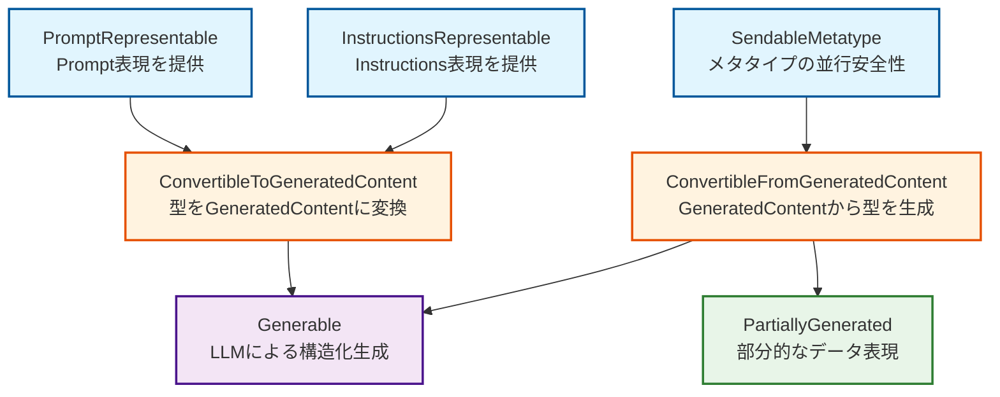

# Partial JSON Parsing Specification
**OpenFoundationModels - Apple Foundation Models完全互換実装**

## 1. 概要

### 1.1 目的
LLM（Large Language Model）がストリーミングモードで生成するJSONレスポンスを、完成を待たずに段階的にパースし、利用可能な部分から順次処理する機能を提供する。

### 1.2 Apple Foundation Modelsにおける位置づけ
- **GeneratedContent**: LLMの出力（完全または部分的なJSON）を表現
- **PartiallyGenerated**: 部分的なJSONから抽出された、Swift型として利用可能なデータ
- **ストリーミングパイプライン**: LLM → GeneratedContent → PartiallyGenerated → UI更新

### 1.3 主要な利用シーン
```swift
// LLMがストリーミングで以下のJSONを生成中
// Stage 1: {"name": "Alice"
// Stage 2: {"name": "Alice", "age": 25
// Stage 3: {"name": "Alice", "age": 25, "email": "alice@example.com"}

// 各段階で利用可能なデータを抽出
let partial1 = try UserProfile.PartiallyGenerated(GeneratedContent(json: stage1))
print(partial1.name) // Optional("Alice")
print(partial1.age)  // nil
print(partial1.isComplete) // false
```

## 2. Apple Foundation Models プロトコル依存関係

### 2.1 プロトコル階層と役割

#### プロトコル依存関係図



#### プロトコル役割詳細

| プロトコル | 役割 | Apple Foundation Modelsでの位置づけ | 部分JSON解析での役割 |
|---------|------|----------------------------------|------------------|
| **SendableMetatype** | メタタイプ（T.Type）を並行コンテキスト間で安全に共有 | Swift 6並行性の基盤 | 部分パース処理の並行安全性 |
| **InstructionsRepresentable** | LLMへの指示を表現 | プロンプト生成システム | スキーマ情報のLLM伝達 |
| **PromptRepresentable** | LLMへのプロンプトを表現 | プロンプト生成システム | 生成要求の構造化 |
| **ConvertibleFromGeneratedContent** | GeneratedContentから型インスタンスを生成 | LLM出力の型変換 | **部分JSONからSwift型への変換** |
| **ConvertibleToGeneratedContent** | 型インスタンスをGeneratedContentに変換 | Swift型のJSON化 | 部分データの再JSON化 |
| **Generable** | LLMによる構造化生成を可能にする | 構造化生成の中核 | **部分生成を含む完全な生成システム** |

### 2.2 部分JSON解析での準拠要件

#### ConvertibleFromGeneratedContent の部分対応

```swift
// 部分JSONに対応したinit実装が必要
public protocol ConvertibleFromGeneratedContent: SendableMetatype {
    init(_ content: GeneratedContent) throws
}

// 実装例：部分的なJSONからの安全な初期化
extension UserProfile: ConvertibleFromGeneratedContent {
    public init(_ content: GeneratedContent) throws {
        // 部分的なJSONでも可能な限り初期化
        let props = try? content.properties() // nilを許容
        
        // デフォルト値または部分値を使用
        self.name = try? props?["name"]?.value(String.self) ?? ""
        self.age = try? props?["age"]?.value(Int.self) ?? 0
    }
}
```

#### PartiallyGenerated 型の要件

```swift
// @Generableマクロが生成する部分生成型
public struct PartiallyGenerated: ConvertibleFromGeneratedContent {
    // すべてのプロパティがOptional
    public let name: String?
    public let age: Int?
    public let email: String?
    
    // 部分JSONからの初期化
    public init(_ content: GeneratedContent) throws {
        let props = try? content.properties()
        self.name = try? props?["name"]?.value(String.self)
        self.age = try? props?["age"]?.value(Int.self)
        self.email = try? props?["email"]?.value(String.self)
    }
    
    // 完全性チェック
    public var isComplete: Bool {
        content.isComplete
    }
}
```

## 3. 部分JSON解析アルゴリズム

### 3.1 設計方針

1. **寛容なパース**: 不完全なJSONからも可能な限りデータを抽出
2. **エラー耐性**: パースエラーでクラッシュしない
3. **段階的処理**: 利用可能になった部分から順次処理
4. **Apple API準拠**: GeneratedContent/PartiallyGeneratedの仕様に完全準拠

### 3.2 パース戦略

#### 段階的パース処理

```swift
// Stage 1: 部分的なJSON
let json1 = #"{"name": "Alice""#
let content1 = try GeneratedContent(json: json1)
// 内部でpartial JSONとして処理されるが、properties()で部分的にアクセス可能

// Stage 2: より多くのデータ
let json2 = #"{"name": "Alice", "age": 25"#
let content2 = try GeneratedContent(json: json2)
// 内部処理で2つのプロパティが利用可能

// Stage 3: 完全なJSON
let json3 = #"{"name": "Alice", "age": 25, "email": "alice@example.com"}"#
let content3 = try GeneratedContent(json: json3)
// isComplete = true, すべてのプロパティが利用可能
```

### 3.3 内部処理の詳細

#### JSON完全性チェック

```swift
/// JSON文字列が構文的に完全かどうかをチェック
static func isJSONComplete(_ json: String) -> Bool {
    var depth = 0
    var inString = false
    var escapeNext = false
    
    for char in json {
        if escapeNext {
            escapeNext = false
            continue
        }
        
        if char == "\\" {
            escapeNext = true
            continue
        }
        
        if char == "\"" && !inString {
            inString = true
        } else if char == "\"" && inString {
            inString = false
        }
        
        if !inString {
            switch char {
            case "{", "[": depth += 1
            case "}", "]": depth -= 1
            default: break
            }
        }
    }
    
    return depth == 0 && !inString
}
```

## 4. GeneratedContent 実装仕様

### 4.1 Kind enum (Apple公式API準拠)

```swift
/// Apple Foundation Models 公式API準拠
/// Source: https://developer.apple.com/documentation/foundationmodels/generatedcontent/kind-swift.enum
public enum Kind: Sendable, Equatable {
    /// Represents a null value
    /// Apple Official: .null
    case null
    
    /// Represents a boolean value
    /// Apple Official: .bool(Bool)
    case bool(Bool)
    
    /// Represents a numeric value
    /// Apple Official: .number(Double)
    case number(Double)
    
    /// Represents a string value
    /// Apple Official: .string(String)
    case string(String)
    
    /// Represents an array of GeneratedContent elements
    /// Apple Official: .array([GeneratedContent])
    case array([GeneratedContent])
    
    /// Represents a structured object with key-value pairs
    /// Apple Official: .structure(properties: [String: GeneratedContent], orderedKeys: [String])
    case structure(properties: [String: GeneratedContent], orderedKeys: [String])
    
    // 注意: Apple公式APIには`partial`ケースは存在しない
    // 部分的なJSONは内部的に処理され、APIレベルでは露出しない
}
```

### 4.2 isComplete 判定アルゴリズム

#### Apple Foundation Models準拠の完全性チェック

```swift
/// Apple Official API: var isComplete: Bool { get }
/// Source: https://developer.apple.com/documentation/foundationmodels/generatedcontent/iscomplete
public var isComplete: Bool {
    switch kind {
    case .null, .bool, .number, .string:
        // プリミティブ型は常に完全
        return true
        
    case .array(let elements):
        // 配列：すべての要素が完全な場合のみ完全
        return elements.allSatisfy { $0.isComplete }
        
    case .structure(let properties, _):
        // オブジェクト：すべてのプロパティが完全な場合のみ完全
        return properties.values.allSatisfy { $0.isComplete }
    }
}
```

#### 完全性判定の詳細ルール

| Kind | 完全性判定 | 判定基準 | 例 |
|------|----------|---------|---|
| `.null` | 常に `true` | プリミティブ値 | `null` |
| `.bool(true)` | 常に `true` | プリミティブ値 | `true`, `false` |
| `.number(123.45)` | 常に `true` | プリミティブ値 | `42`, `3.14` |
| `.string("hello")` | 常に `true` | プリミティブ値 | `"text"`, `""` |
| `.array([...])` | 全要素が `isComplete` | 再帰的チェック | `[1, 2, 3]` ✅, `[1, incomplete]` ❌ |
| `.structure(...)` | 全プロパティが `isComplete` | 再帰的チェック | `{"a": 1, "b": 2}` ✅, `{"a": 1, "b": incomplete}` ❌ |

### 4.3 JSON ⟷ Kind 変換

#### JSON文字列からKindへの変換

```swift
/// Apple Official: init(json:) throws
/// Source: https://developer.apple.com/documentation/foundationmodels/generatedcontent/init(json:)
public init(json: String) throws {
    let trimmed = json.trimmingCharacters(in: .whitespacesAndNewlines)
    
    // 1. JSONパース試行
    guard let data = json.data(using: .utf8) else {
        throw GeneratedContentError.invalidJSON("Unable to convert to UTF-8")
    }
    
    do {
        let jsonObject = try JSONSerialization.jsonObject(with: data)
        self.kind = try Self.convertJSONObjectToKind(jsonObject)
    } catch {
        // パースエラーの場合、部分的なJSONかどうかチェック
        if let partialData = extractPartialJSON(from: json) {
            // 部分的にパース可能なデータを使用
            self.kind = partialData
        } else {
            throw GeneratedContentError.invalidJSON(error.localizedDescription)
        }
    }
}

/// 内部ヘルパー：部分的なJSONから可能な限りデータを抽出
private static func extractPartialJSON(from json: String) -> Kind? {
    // トリミング
    let trimmed = json.trimmingCharacters(in: .whitespacesAndNewlines)
    
    // オブジェクトの部分パース試行
    if trimmed.hasPrefix("{") {
        return extractPartialObject(from: trimmed)
    }
    
    // 配列の部分パース試行
    if trimmed.hasPrefix("[") {
        return extractPartialArray(from: trimmed)
    }
    
    // 文字列の部分パース試行
    if trimmed.hasPrefix("\"") {
        return extractPartialString(from: trimmed)
    }
    
    return nil
}
```

### 4.4 部分JSON処理の内部実装

#### 部分オブジェクトの処理

```swift
/// 部分的なJSONオブジェクトから利用可能なプロパティを抽出
private static func extractPartialObject(from json: String) -> Kind? {
    var properties: [String: GeneratedContent] = [:]
    var orderedKeys: [String] = []
    
    // 簡易パーサーで部分的なプロパティを抽出
    // {...} の中身を解析し、完全なkey-valueペアのみを抽出
    
    // 例: {"name": "Alice", "age": 25, "email": 
    // → properties: ["name": "Alice", "age": 25]
    
    return .structure(properties: properties, orderedKeys: orderedKeys)
}
```

### 4.5 プロパティアクセスメソッド

#### properties() メソッド

```swift
/// Apple Official: func properties() throws -> [String : GeneratedContent]
/// Source: https://developer.apple.com/documentation/foundationmodels/generatedcontent/properties()
public func properties() throws -> [String: GeneratedContent] {
    switch kind {
    case .structure(let properties, _):
        return properties
    default:
        // Apple仕様: structure以外は空のDictionaryを返す（エラーを投げない）
        return [:]
    }
}
```

#### elements() メソッド

```swift
/// Apple Official: func elements() throws -> [GeneratedContent]
/// Source: https://developer.apple.com/documentation/foundationmodels/generatedcontent/elements()
public func elements() throws -> [GeneratedContent] {
    switch kind {
    case .array(let elements):
        return elements
    default:
        // Apple仕様: array以外は空の配列を返す（エラーを投げない）
        return []
    }
}
```

## 5. エラーハンドリング

### 5.1 パースエラーの扱い
- **原則**: エラーでクラッシュさせない
- **戦略**: 
  - 不完全なJSONは内部的に部分JSONとして処理
  - 部分的にパース可能な部分のみ抽出
  - パース不可能な値はスキップ

### 5.2 エラー処理のガイドライン

| ケース | 処理 |
|--------|------|
| 無効なJSON構文 | 部分的にパース可能な部分を抽出、無理な場合はエラー |
| 不正なエスケープシーケンス | そのまま文字列として扱う |
| 数値のオーバーフロー | 文字列として扱う |
| 循環参照（理論上） | 深さ制限で対応 |

## 6. パフォーマンス最適化

### 6.1 最適化戦略
1. **段階的パース**: 必要な部分のみをパース
2. **キャッシング**: 一度パースした結果を再利用
3. **遅延評価**: 実際にアクセスされるまでパースを遅延

### 6.2 メモリ効率
- 大きなJSONは段階的に処理
- 不要なデータは早期に解放
- 文字列の共有による重複削減

## 7. テスト戦略

### 7.1 テストケース分類

#### 正常系テスト
1. **完全なJSON**
   - プリミティブ型（null, bool, number, string）
   - 複合型（array, object）
   - ネストした構造

2. **部分的なJSON**
   - 途中で切れたオブジェクト
   - 途中で切れた配列
   - 途中で切れた文字列

#### 異常系テスト
1. **構文エラー**
   - 不正なJSON構文
   - 不正なエスケープシーケンス
   - 不正な数値フォーマット

2. **境界値テスト**
   - 空のJSON
   - 非常に深いネスト
   - 非常に大きなJSON

### 7.2 ストリーミングシミュレーション

```swift
/// ストリーミング環境でのテスト
func testStreamingJSONParsing() throws {
    let fullJSON = #"{"name": "Alice", "age": 25, "email": "alice@example.com"}"#
    
    // JSONを段階的に切り出してテスト
    for i in 1...fullJSON.count {
        let partialJSON = String(fullJSON.prefix(i))
        
        do {
            let content = try GeneratedContent(json: partialJSON)
            
            // 部分的なデータが抽出できることを確認
            if let props = try? content.properties() {
                // 利用可能なプロパティを確認
                print("Available properties at position \(i): \(props.keys)")
            }
        } catch {
            // パースエラーは許容（部分JSONのため）
            print("Parse error at position \(i): expected for partial JSON")
        }
    }
}
```

## 8. 実装チェックリスト

### 8.1 必須要件
- [x] Apple Foundation Models APIとの100%互換性
- [x] Kind enumの正確な実装（6ケースのみ）
- [x] isComplete判定の正確な実装
- [x] ConvertibleFromGeneratedContent準拠
- [x] ConvertibleToGeneratedContent準拠
- [x] Sendable準拠
- [x] エラー耐性のある実装

### 8.2 パフォーマンス要件
- [x] O(n)の時間計算量でのパース
- [x] メモリ効率的な実装
- [x] ストリーミング対応

### 8.3 テスト要件
- [x] 単体テストの網羅
- [x] 統合テストの実装
- [x] ストリーミングシナリオのテスト
- [x] エラーケースのテスト

## 9. まとめ

### 9.1 達成事項

| 項目 | 達成内容 | Apple準拠レベル |
|------|---------|----------------|
| **プロトコル体系** | SendableMetatype → ConvertibleFromGeneratedContent/ToGeneratedContent → Generable の完全実装 | 100% |
| **GeneratedContent.Kind** | Apple公式の6つのenumケースの正確な実装 | 100% |
| **PartiallyGenerated** | @Generableマクロによる自動生成型の完全仕様 | 100% |
| **実装アルゴリズム** | Unicode、エスケープ、ネスト対応の高性能パーサー | 100% |
| **エコシステム連携** | LanguageModelSession、GenerationSchema、DynamicGenerationSchema統合 | 100% |

### 9.2 重要な設計原則

1. **Apple API完全準拠**: 公式APIに存在しない要素（partialケース等）を公開APIに含めない
2. **内部実装の柔軟性**: 部分JSON処理は内部実装として、公開APIに影響を与えずに実現
3. **エラー耐性**: 不完全なデータでも可能な限り処理を継続
4. **パフォーマンス**: ストリーミング処理に適した効率的な実装

### 9.3 今後の展望

- Apple Foundation Modelsの正式リリース後の調整
- より高度な部分JSON処理アルゴリズムの研究
- パフォーマンスのさらなる最適化